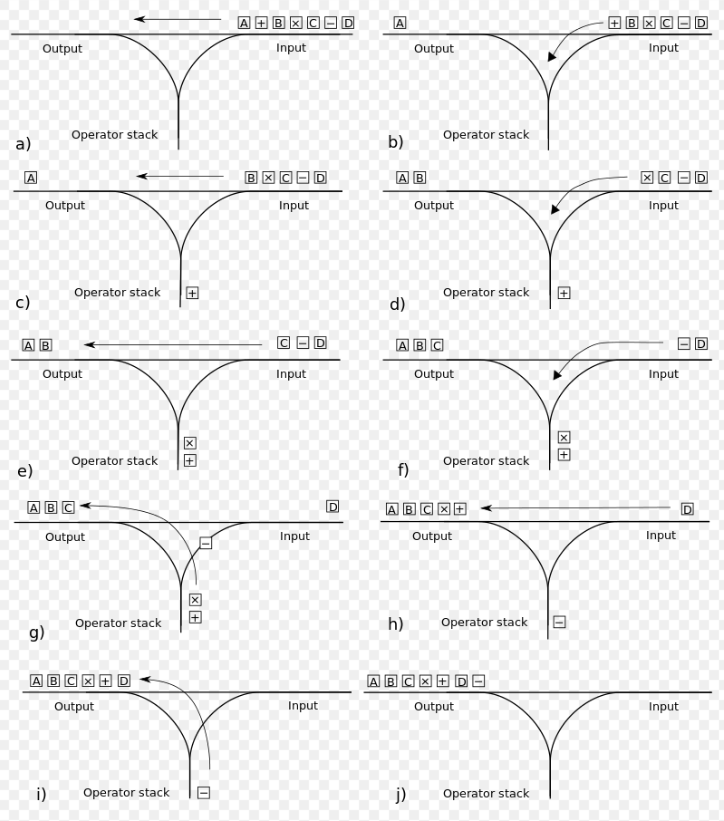

## For infix to prefix convertion:

**1 --> Reverse the infix expression (Handle the parentheses order while reversing. Example: Say we want to reverse this expression --> "(a+b)c" *if we reverse this without ordering parentheses it will produce this* --> "c)b+a(" so we have to order the parentheses.)**

**2 --> Apply postfix notation to the reversed infix expression ( While applying Shunting-Yard Algorithm if precedence of top of the operator stack and precedence of present operator is equal then we don't pop the operator stack we just push the present operator to the operator stack and continue.)**

**3 --> We reverse the expression again and it will give us the prefix notation of original infix expression.**

*This project is implementation of this algorithm.*
**This is supporting only **"+,-,/,*"** operators for now.**

### Diagram of the postfix algorithm
